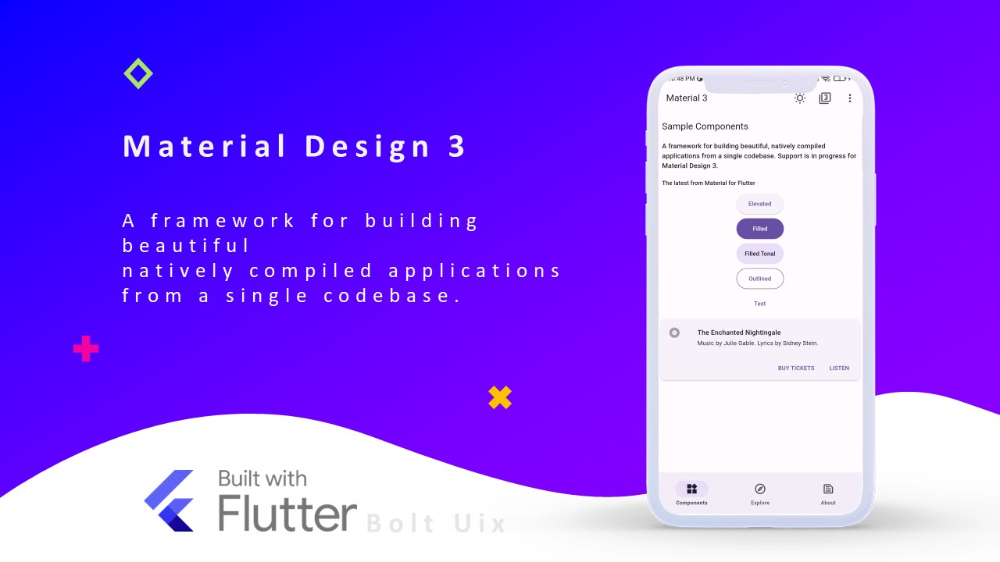
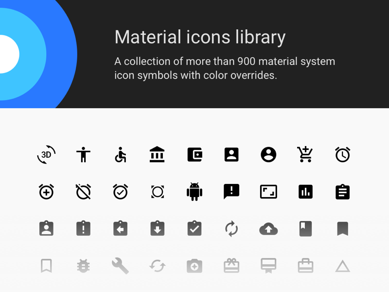
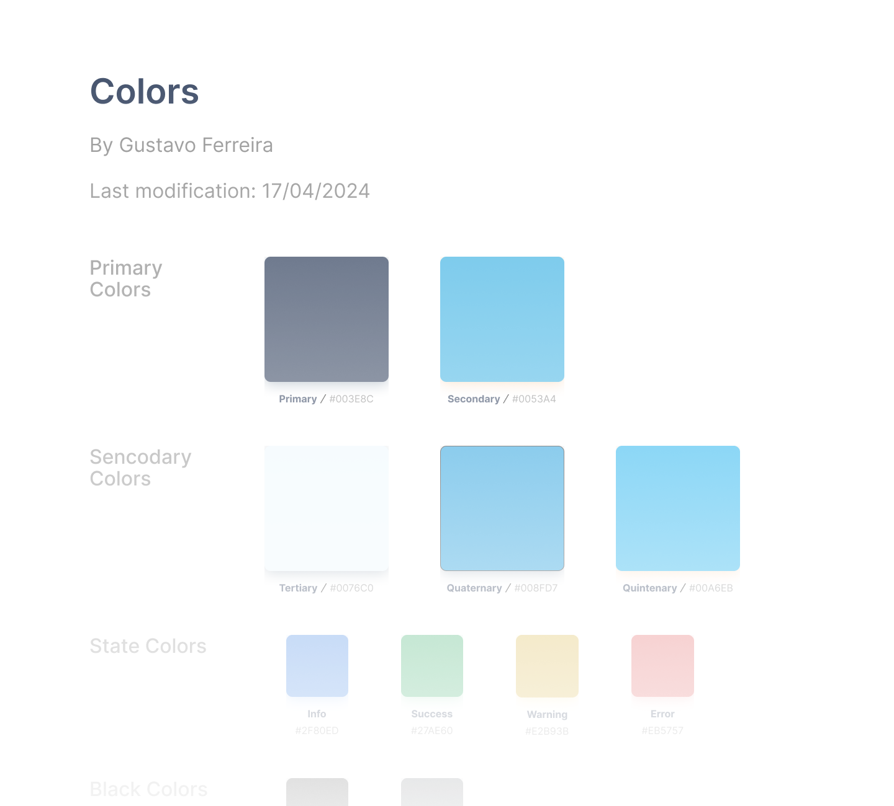
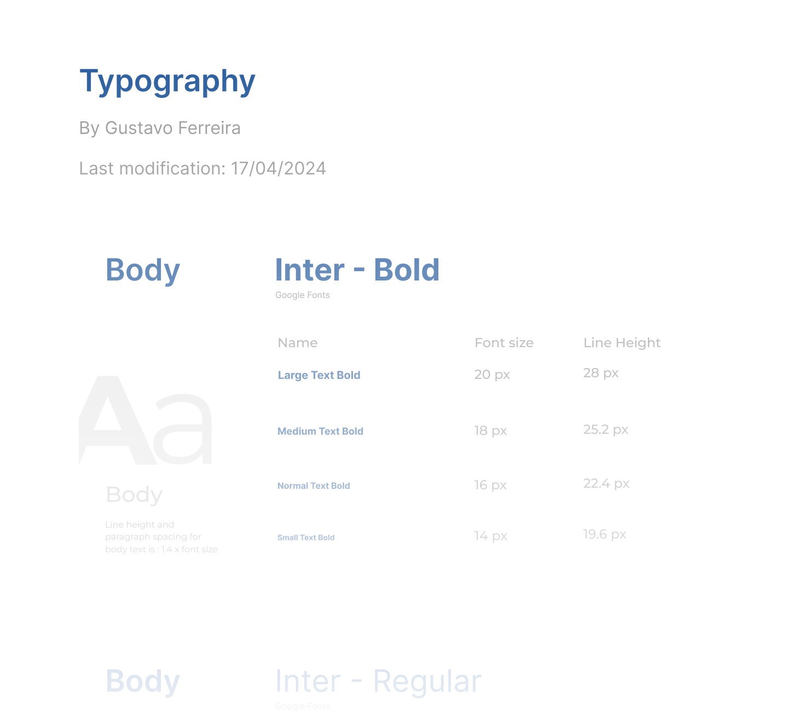
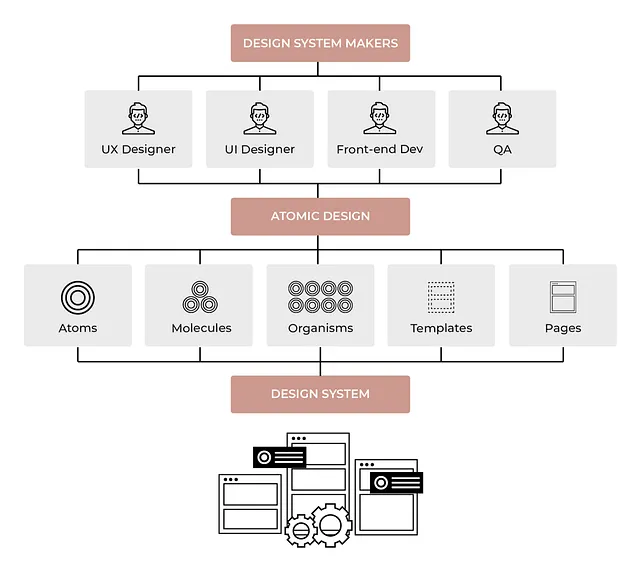

# Design System

O Design System é um conjunto de padrões, diretrizes e componentes utilizados para garantir um design consistente e coeso em um produto. Essa ferramenta é crucial para manter a consistência do design e a qualidade do produto, facilitando o processo de desenvolvimento e manutenção. Além disso, assegura que o produto final seja intuitivo e acessível para os usuários.

## Spalla

Em uma orquestra, o spalla é o primeiro violinista e lidera a seção de violinos. Ele é responsável por coordenar o grupo, assegurando que todos os músicos toquem de forma sincronizada e harmoniosa. Analogamente, o Spalla serve como uma metáfora para o Design System, atuando como o "líder" do design. Assim como um violino é formado por várias peças que, juntas, criam um instrumento completo, o Design System reúne diversos componentes que, combinados, resultam em um produto harmonioso e funcional.

### Material 3

Material 3 é a mais recente evolução do Material Design, um sistema de design desenvolvido pelo Google. Este sistema foi concebido para auxiliar os desenvolvedores a criar interfaces que sejam não apenas esteticamente agradáveis, mas também funcionais. Ele se baseia em princípios de design como materialidade, movimento e hierarquia visual. O Material Design incorpora uma variedade de elementos, tais como botões, cards, listas e tipografias, que facilitam a criação de interfaces consistentes e coesas.

### Material Icons

Material Icons é uma coleção de ícones desenvolvida pelo Google, projetada para ser empregada em interfaces de usuário. Esses ícones facilitam a representação visual de ações, objetos e conceitos, tornando a interface mais intuitiva e amigável. Os ícones do Material Icons seguem um estilo simples e limpo, harmonizando perfeitamente com os princípios do Material Design.

### Color Palette

A paleta de cores é essencial para estabelecer uma identidade visual coerente e atraente em um design. Ela deve consistir em cores que se complementam e sejam agradáveis aos olhos, ajudando a criar uma hierarquia visual que destaca elementos importantes e gera contraste. No projeto atual, a cor azul foi escolhida como a cor principal. Associada à confiança, segurança e tranquilidade, esta cor também faz parte da identidade visual do Hospital Sírio-Libanês, reforçando sua importância e simbolismo.

### Typography

A tipografia é um elemento chave do design, utilizado para transmitir informações de maneira clara e eficiente. Ela contribui para a criação de uma hierarquia visual, ressaltando elementos significativos e proporcionando contraste. Para este projeto, as fontes Roboto e Inter foram selecionadas como as principais. Ambas são modernas e legíveis, alinhando-se perfeitamente com os princípios do Material Design.

Todos esses elementos se combinam, formando os "team components" do Design System. Eles são componentes de design e desenvolvimento criados e mantidos por equipes individuais dentro de uma organização. Eles são projetados para atender a requisitos exclusivos de projetos específicos ou necessidades de times particulares. 

## Por que usar um Design System?

Desenvolver um Design System pode até parecer um tanto trabalhoso, porém, este tipo de ferramenta pode poupar muitas horas de desenvolvimento. Além disso, o Design System possui outros benefícios atrelados, como:

- **Manutenção da Identidade da Marca:** a criação de um Design System implica na criação de regras visuais e, com resultado — tendo a definição de padrões de comunicação visual inclinados a todos os desenvolvimentos;
- **Consistência:** o Design System permite que os desenvolvedores criem interfaces mais consistentes, uma vez que os elementos de UI (User Interface) estão padronizados e sob a correta diretriz de uso;
- **Melhor e maior qualidade:** consistência e padronização levam a uma maior e melhor qualidade da interface. Com isso, os erros se tornam raros e a experiência do usuário é aprimorada;
- **Redução de pensamento:** a utilização de um Design System pressupõe a disponibilização de uma experiência fluída e com a capacidade de redução gradual da necessidade de pensamento para a execução de determinadas ações;
- **Melhora na comunicação entre as equipes:** o Design System é a “fonte da verdade”, portanto, as discussões entre desenvolvedores e designers tendem a se amenizar uma vez que todas as diretrizes e elementos estão oficializados. Ele acaba ajudando as empresas a criarem pontes entre as equipes;
- **Rapidez no processo do design:** o Design System nos permite um aumento relativo do processo de Design, ou seja, o desenvolvimento de interfaces se torna bem mais ágil e fácil;
- **Um foco maior no UX:** uma vez que os elementos do design system estão padronizados, os designers conseguem dar mais foco para a experiência do usuário ao invés da criação dos componentes. O design system ajuda aprimorar a experiência dos usuários finais.
- **Redução dos Custos de Design:** a criação de um Design System significa a redução de esforço do design e tem como consequência a redução dos custos de desenvolvimento na medida em que existe um UI kit disponível para aplicar em todos os projetos;
- **Redução de custos de desenvolvimento:** com o Design System, é possível reduzir a duração de um projeto em 50%, representando uma diminuição de custos substancial. Os developers não precisam tomar decisões de Design e de estrutura de desenvolvimento front-end, ficando inteiramente dedicados e focados na implementação dos componentes existentes;
- **Reutilização de componentes:** o Design System pode atuar na difusão do desenvolvimento modular e na reutilização de componentes, de acordo com a abordagem de Brad Frost, o Atomic Design. Ou seja, consiste na criação de um único componente capaz de servir às mais diversas plataformas.

## Conclusão

O Design System é uma ferramenta essencial para assegurar a consistência e a qualidade do design de um produto. Ele simplifica o processo de desenvolvimento e garante que o produto final seja intuitivo e acessível para os usuários. Além disso, o Design System ajuda a manter a identidade da marca, aprimora a comunicação entre equipes e reduz os custos associados ao design e desenvolvimento. Em suma, o Design System é um recurso valioso que pode otimizar o processo de design e melhorar significativamente a experiência do usuário.