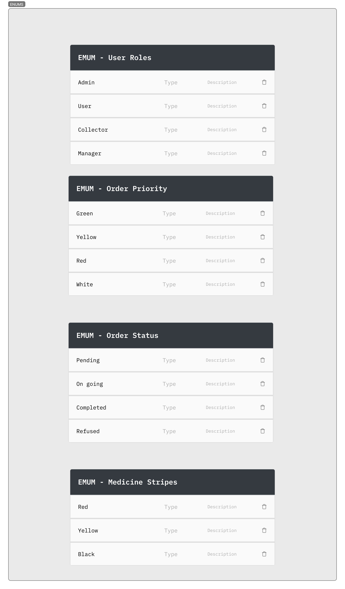

# Data Modeling

## Introdução ao Data Modeling

Data modeling (modelagem de dados) é um processo analítico aplicado para definir as estruturas de dados de um sistema de forma detalhada. A modelagem é fundamental para a construção de softwares que dependem de interações complexas de dados e serve para organizar e especificar as relações entre diferentes entidades de dados.

## Data Modeling

## Descrição das Tabelas e Relacionamentos

### Tabela: `Users`

Armazena as informações dos usuários. Cada registro nesta tabela possui um `id` único, `nome`, `email`, entre outros atributos pessoais e de acesso como `password`.

### Tabela: `Blocked_Users`

Contém informações sobre usuários que foram bloqueados temporariamente ou permanentemente, referenciando `user_id` da tabela `Users`.

### Tabela: `Medicines`

Registra detalhes dos medicamentos disponíveis, incluindo `batch` (lote), `name` (nome) e `strip` (faixa de controle).

### Tabela: `Medicine_PXSTS`

Possivelmente controla o status de prescrição (PX) dos medicamentos para os usuários, conectando `medicine_id` da tabela `Medicines` e `user_id` da tabela `Users`.

### Tabela: `PYXTS`

Essa tabela parece estar relacionada com outra forma de status ou registro ligado ao usuário ou prescrição médica, com atributos como `created_at`.

### Tabela: `Orders`

Armazena os pedidos realizados pelos usuários, indicando `priority` (prioridade) e `status` (estado do pedido), além de fazer referência a `user_id` da tabela `Users`.

### Tabela: `User_Order_Responsibility`

Define responsabilidades específicas dos usuários em relação aos pedidos. Relaciona `user_id` da tabela `Users` com `order_id` da tabela `Orders`.

### Enum: `User Roles`

Define os papéis de usuários dentro do sistema.

### Enum: `Order Priority`

Categoriza os pedidos por níveis de prioridade como `low`, `normal`, e `high`.

### Enum: `Order Status`

Descreve os possíveis estados de um pedido, incluindo `Pending`, `Complete`, e `Received`.

### Enum: `Medicine Stripes`

Detalha os tipos de faixas de medicamentos disponíveis.

## Relacionamentos

- **Users e Blocked_Users:** `Blocked_Users.user_id` é uma chave estrangeira que referencia `Users.id`.
- **Users e Medicine_PXSTS:** `Medicine_PXSTS.user_id` referencia `Users.id`.
- **Medicines e Medicine_PXSTS:** `Medicine_PXSTS.medicine_id` referencia `Medicines.id`.
- **Users e Orders:** `Orders.user_id` referencia `Users.id`.
- **Orders e User_Order_Responsibility:** `User_Order_Responsibility.order_id` referencia `Orders.id`.
- **User_Order_Responsibility e Users:** `User_Order_Responsibility.user_id` referencia `Users.id`.

Essas relações ajudam a manter a integridade dos dados e facilitam consultas complexas e relatórios dentro do sistema.
